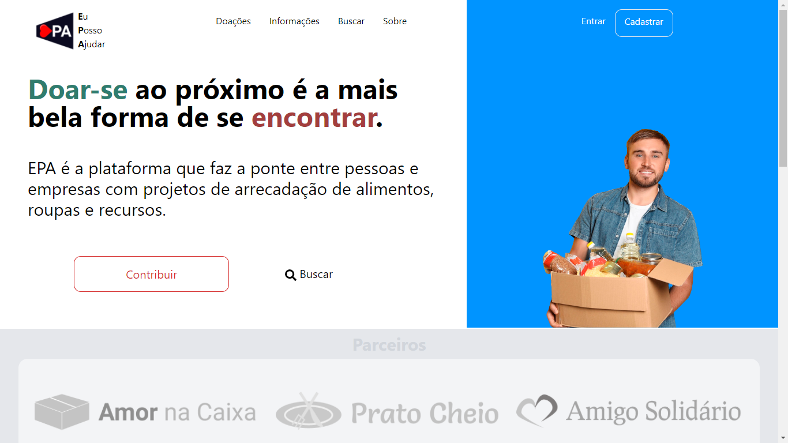
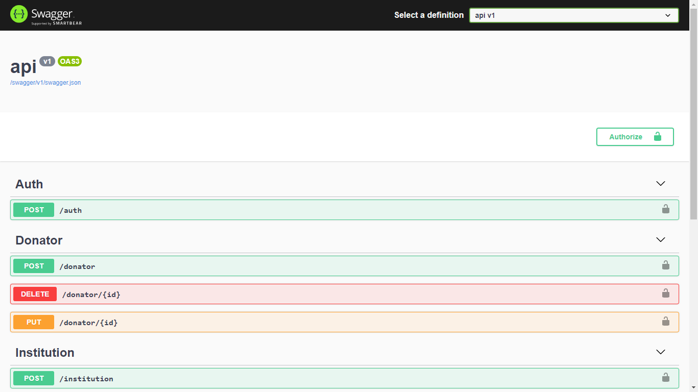

# Eu Posso Ajudar
Plataforma para conectar Doadores e Instituições 
de Caridade. 

<br/>

Acesso ao fontend [aqui](https://eu-posso-ajudar.vercel.app/)

## Imagens



## Início Rápido
Para utilizar esse projeto você precisa ter instalado em sua máquina o [.NET Core CLI](https://dotnet.microsoft.com/download) e [Node.js](https://nodejs.org/en/).

### Frontend
```Javascript
cd frontend
yarn dev || npm run dev
```

### Backend
```C#
cd api
dotnet run
```

## Tecnologias
 - [x] [.NET Core](https://dotnet.microsoft.com/download)
 - [x] [Node.js](https://nodejs.org/en/)
 - [x] [Next.js](https://nextjs.org/)
 - [x] [React.js](https://pt-br.reactjs.org/)
 - [x] [MongoDB](https://www.mongodb.com/) 

## Informação
> Esse projeto se trata de uma plataforma fictícia para testes. Marcas e logomarcas utilizadas foram criadas com intuíto ilustrativo.

